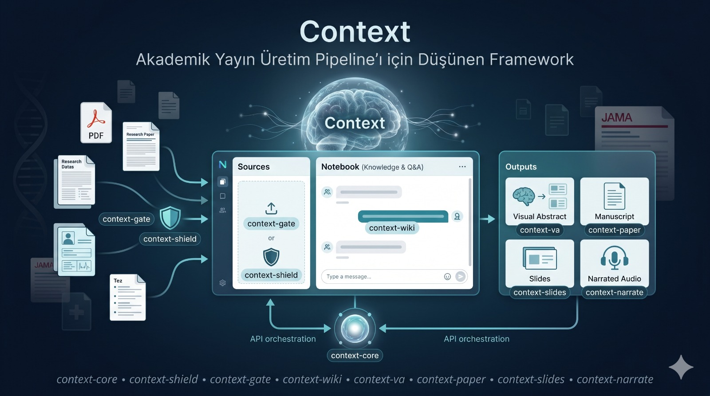

# Context-Med

**Akademik Yayın Üretim Pipeline’ı**  
Tıp araştırmacıları ve akademisyenler için geliştirilen, ham PDF, tez ve araştırma verilerini kaliteli akademik çıktılara dönüştüren AI-powered framework.

[](LICENSE)
[](https://www.python.org)
[](https://github.com/nurettinz/context-med)

---

## 🎯 Nedir?

**Context-Med**, araştırmacıların yüklediği ham kaynakları (PDF makale, tez, hasta verisi vb.) şu akademik formatlara dönüştüren uçtan uca bir pipeline’dır:

- **Visual Abstract** (`context-va`) — JAMA/NEJM standartlarında grafik özet
- **Manuscript** (`context-paper`) — Tam akademik makale
- **Slides** (`context-slides`) — Konferans sunum destesi
- **Narrated Audio** (`context-narrate`) — Makale seslendirme / narrated abstract



Tüm süreç **context-core** tarafından orkestre edilir ve tıbbi gizlilik kurallarına (`context-shield`) uygun olarak çalışır.

## ✨ Bileşenler

| Bileşen              | İsim                | Görevi |
|----------------------|---------------------|--------|
| Orchestrator        | `context-core`     | Tüm pipeline’ı koordine eder |
| Privacy Layer       | `context-shield`   | PII maskeleme (edge’de çalışır) |
| Ingest Gate         | `context-gate`     | Kaynak kalite kontrolü & provenans |
| Knowledge Layer     | `context-wiki`     | RAG + micro-wiki oluşturma |
| Graphical Abstract  | `context-va`       | Visual Abstract üretimi |
| Manuscript          | `context-paper`    | Akademik makale yazımı |
| Presentation        | `context-slides`   | Slayt destesi üretimi |
| Narrated Output     | `context-narrate`  | Sesli çıktı (narrated abstract) |

## 🚀 Hızlı Başlangıç

```bash
# Repo'yu klonla
git clone https://github.com/xtatistix/context-med.git
cd context-med

# Bağımlılıkları kur
pip install -e .

# Basit kullanım örneği
context-med run paper --input sample.pdf --style jama

# Visual Abstract üretimi
context-med run va --input article.pdf

# Slayt + narrated versiyon
context-med run slides --input manuscript.pdf --narrate
```

## 📋 Kullanım Örnekleri

```bash
# 1. Tek komutla tüm çıktıları üret
context-med run all --input my_paper.pdf

# 2. Sadece visual abstract
context-med run va --input my_paper.pdf --output output/

# 3. Sesli narrated abstract
context-med run narrate --input manuscript.pdf --voice formal
```

## 🏗️ Mimari

```
context-ui (Web + Mobile)
    ↓ (API)
context-shield → context-core (Orchestrator)
                    ↓
    ├── context-gate
    ├── context-wiki
    ├── context-va
    ├── context-paper
    ├── context-slides
    └── context-narrate
```

`context-core` **headless** tasarlanmıştır. Web arayüzü (`context-ui`) ayrı bir modül olarak geliştirilmektedir.

## 🎯 Hedef Kitle

- Tıp araştırmacıları
- Akademisyenler ve öğretim üyeleri
- Klinik araştırmacılar
- Q1 dergilere (JAMA, NEJM, Lancet vb.) makale hazırlayan ekipler

## 📄 Lisans

Bu proje [MIT Lisansı](LICENSE) ile lisanslanmıştır.

## 🤝 Katkıda Bulunma

Katkılar çok memnuniyetle karşılanır. Lütfen önce bir Issue açarak tartışalım.

## 📬 İletişim

- Github: xtatistix
- GitHub Issues üzerinden öneri ve hata bildirimleri

---

**Context-Med** — Ham veriden akademik yayın kalitesinde çıktıya.

Made with ❤️ for medical researchers.
