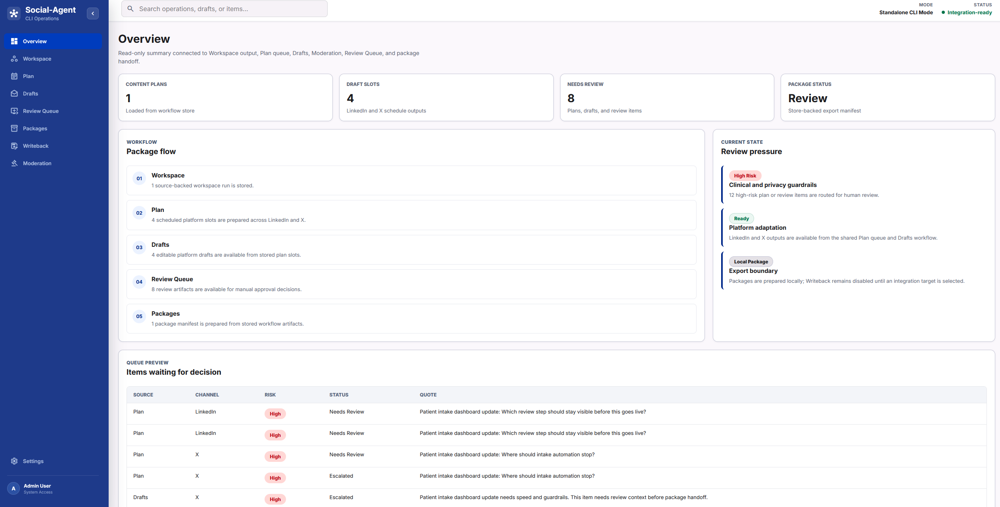
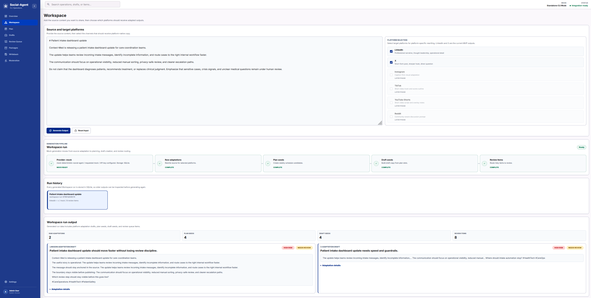
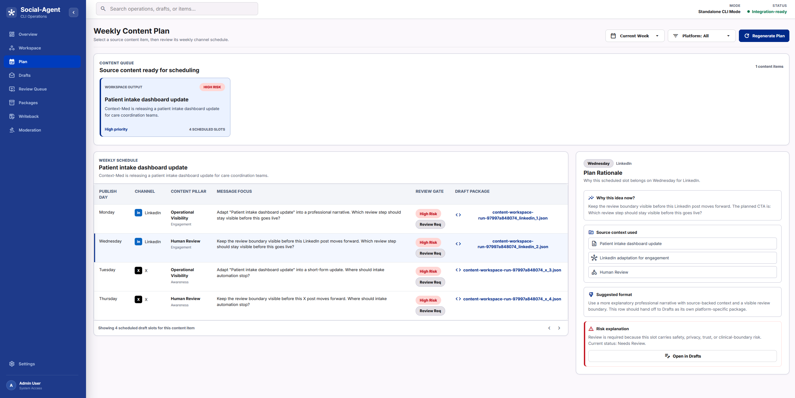
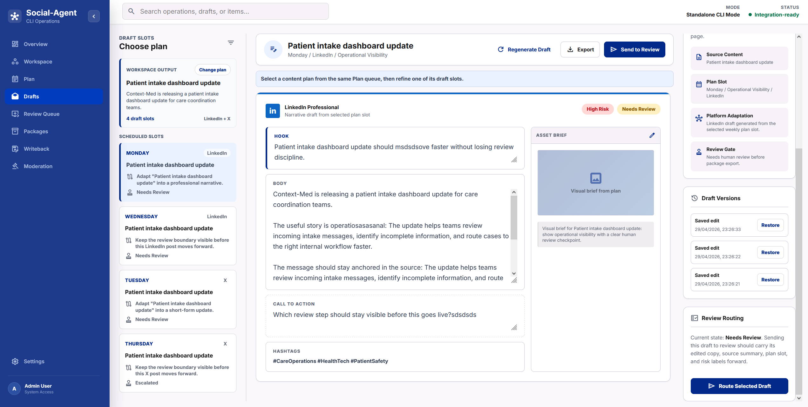
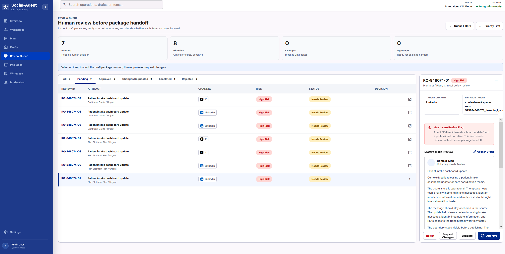
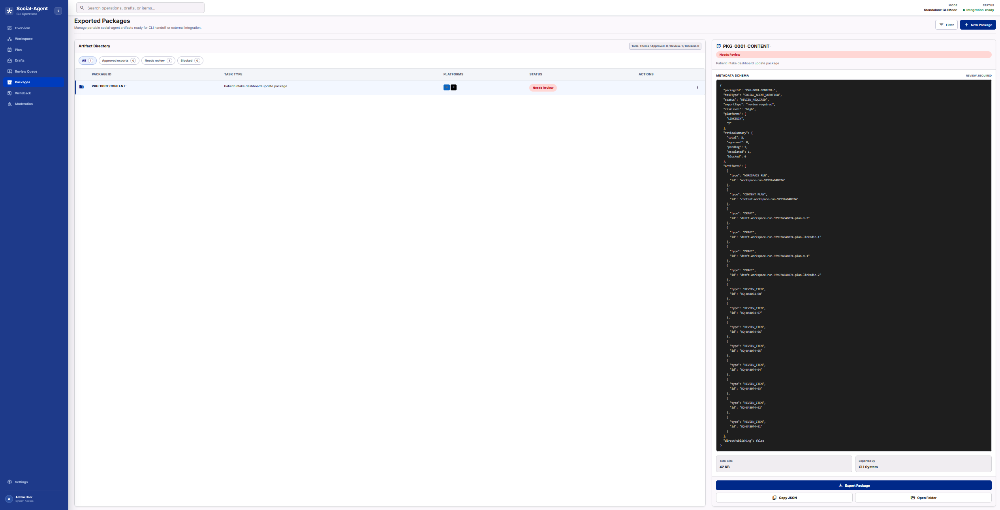
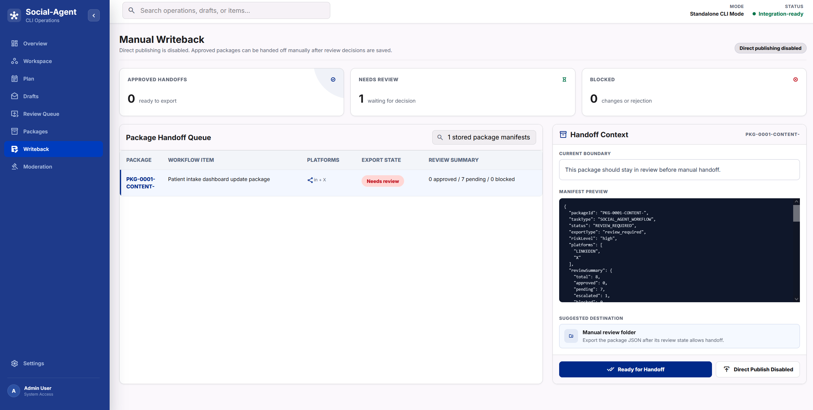
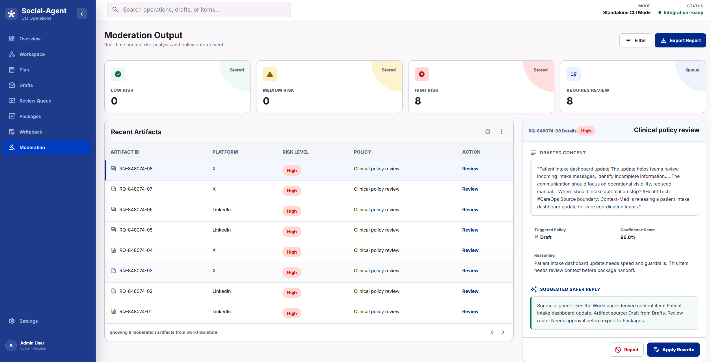
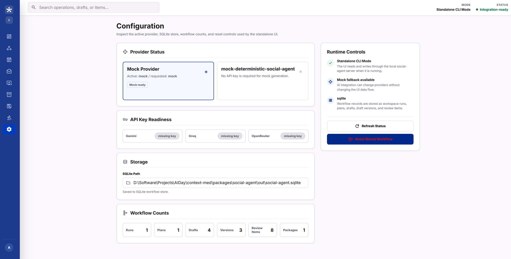

# social-agent

Standalone social operations package for Context-Med.

`social-agent` helps turn source context into review-ready social media work. It currently supports LinkedIn and X workflows through a package-local CLI, SQLite-backed workflow records, JSON outputs, and a local demo UI.

The package is designed as a small social operations layer, not only a caption generator. It takes a source briefing, creates a platform-aware plan, drafts social copy, checks community comments, and keeps risky or sensitive items behind a human review step before package handoff.

## Project Goal

Context-Med content can include healthcare-adjacent topics, privacy concerns, crisis signals, and product claims that should not be published without review. `social-agent` keeps those constraints visible while producing useful social workflow output.

The current goal is to provide a demoable MVP that shows:

- how a source briefing becomes a social plan;
- how the same idea is adapted differently for LinkedIn and X;
- how review-required work is collected in one queue;
- how generated work can be exported as JSON for manual handoff.

The package intentionally avoids direct publishing. It focuses on planning, drafting, moderation, review, and export.

## What It Does

- Builds a social plan from source context.
- Creates platform-aware LinkedIn and X draft outputs.
- Collects approval/escalation items in a review queue.
- Stores Workspace runs, content plans, drafts, draft versions, review decisions, and package manifests locally.
- Shows the active LLM provider, model, API key readiness, storage path, and fallback state in the UI.
- Serves the package API and, when built, the React standalone UI from `packages/social-agent/demo/dist`.

## Workflow

The main workflow is:

1. Add source context and select target platforms in Workspace.
2. Generate a Workspace run.
3. Review the planned LinkedIn/X schedule in Plan.
4. Inspect and edit platform drafts in Drafts.
5. Approve, request changes, reject, or escalate items in Review Queue.
6. Export approved, review-required, or blocked manifests from Packages for manual handoff.

All React screens read from the same SQLite-backed workflow snapshot, so the demo behaves like one connected workflow instead of separate static pages.

## Data Flow

The React standalone UI and package server use these stored workflow records:

- `workspace_run` - the raw result of a Workspace generation request. It contains source text, selected platforms, provider metadata, platform adaptations, plan seeds, draft seeds, and review seeds.
- `content_plan` - the scheduled content queue item derived from a Workspace run. Plan reads this to show weekly slots and platform timing.
- `draft` - the editable platform copy derived from a plan slot. Drafts reads and updates this record when hook, body, CTA, or hashtags change.
- `draft_version` - a saved copy of a draft edit. Drafts uses this for lightweight version history and restore actions.
- `review_item` - a human decision item created by the pipeline or by Drafts when a draft is sent to review. Review Queue updates this record with approved, rejected, changes-requested, or escalated status.
- `package manifest` - computed from stored `content_plan`, `draft`, and `review_item` records. Packages does not invent a separate artifact; it exports a manifest based on current approval state.

The package manifest status is derived from review state:

- `APPROVED_EXPORT` when all review items for a content plan are approved.
- `REVIEW_REQUIRED` when pending or escalated review items remain.
- `BLOCKED` when a review item is rejected or changes are requested.
- `READY_FOR_HANDOFF` when no review blockers exist.

SQLite is intentionally package-local. If the API is unavailable, the UI falls back to browser/local mock state so the demo still opens, but stored workflow behavior requires the package server.

## Screens

### Workspace

Workspace is the main input surface. It accepts:

- source context;
- target platform selection;
- local deterministic generation or optional provider-backed generation.

The generated Workspace run is persisted and feeds Plan, Drafts, Review Queue, Overview, and Packages.

Workspace also includes a run history panel. Each generate action creates a stored `workspace_run`, and older runs can be reloaded for inspection.

### Plan

Plan shows scheduled social items for LinkedIn and X. It includes platform, suggested day, topic, CTA, risk, status, and approval state. The UI also avoids assigning the same platform to the same day more than once when generated items collide.

### Drafts

Drafts shows editable platform copy for LinkedIn and X. It keeps metadata separate from the actual post text, saves edits back to the stored `draft` record, and can route edited copy to Review Queue.

Draft edits create `draft_version` records. The UI can restore recent saved versions without changing the rest of the workflow.

### Moderation

Moderation summarizes stored review artifacts and policy-sensitive items. It is connected to the same review data used by Review Queue.

### Review Queue

Review Queue is the human approval gate. It collects plan and draft items that require review before package handoff. Actions persist approve, request changes, reject, and escalate decisions.

Review decisions synchronize the related `draft` and `content_plan` slot status so Overview, Packages, Drafts, and Writeback reflect the same state.

### Packages

Packages shows JSON package manifests computed from current stored records. Direct publishing is out of scope; the package is meant for manual review and handoff.

### Writeback and Settings

Writeback documents the manual handoff boundary and shows approved, review-required, or blocked package candidates. Settings shows provider status, API key readiness, SQLite path, workflow counts, and reset controls.

## Boundaries

- No direct social publishing.
- Uses a package-local SQLite database through `sql.js`; no external database service is required.
- No external server framework.
- Gemini, Groq, and OpenRouter generation are optional. Without a configured provider API key, the package uses deterministic mock fallback output.
- Human review remains required for risky or sensitive outputs.

## Output Shape

The package API produces a single demo payload with:

- `summary` - high-level topic, risk, and package counts.
- `plan` - social calendar items.
- `drafts` - platform-specific final copy and adaptation metadata.
- `moderation` - community comment reports.
- `review_queue` - items that need approval, revision, or escalation.
- `packages` - export package metadata.
- `writeback` - disabled writeback status.
- `settings` - supported platforms and generation mode.

This shape is used by both the demo UI and package API.

## Setup

```bash
cd packages/social-agent
npm install
```

## Quick Start

For the connected React UI, run the package server and the Vite UI together.

Terminal 1 starts the social-agent API, SQLite store, demo API, and workflow endpoints:

```bash
cd packages/social-agent
npm start
```

Terminal 2 starts the React/Vite UI:

```bash
cd packages/social-agent
npm run ui:dev
```

Then open:

```text
http://127.0.0.1:5173
```

The React dev server proxies `/api` requests to `http://127.0.0.1:3000`, so Workspace generation, provider status, SQLite workflow records, draft saves, review decisions, and package manifests stay connected.

For CLI/API-only testing, run only:

```bash
npm start
```

Then use:

```text
http://127.0.0.1:3000
```

This serves the package-local demo server and API endpoints.
If no React build exists under `demo/dist`, the port shows a small API landing page. The full UI is developed through Vite at `http://127.0.0.1:5173`.

Optional live generation:

```bash
copy .env.example .env
```

Then set:

```env
LLM_PROVIDER=gemini
LLM_MODEL=gemini-2.5-flash
GEMINI_API_KEY=your_key_here
```

Alternative providers:

```env
LLM_PROVIDER=groq
LLM_MODEL=llama-3.1-70b-versatile
GROQ_API_KEY=your_key_here
```

```env
LLM_PROVIDER=openrouter
LLM_MODEL=meta-llama/llama-3.1-70b-instruct
OPENROUTER_API_KEY=your_key_here
```

To force deterministic local generation:

```env
LLM_PROVIDER=mock
```

## CLI Usage

```bash
npm run cli -- plan --input demo/social-agent-source.md --output out/plan.json
npm run cli -- draft --input demo/social-agent-source.md --output out/drafts.json
npm run cli -- moderate --input comments.txt --output out/moderation.json
```

The CLI commands are useful for validating package behavior without opening the demo UI.

Command responsibilities:

- `plan` creates a social calendar.
- `draft` creates LinkedIn and X draft outputs.
- `moderate` classifies a comment input and returns review guidance.
- `serve` starts the local demo UI.

Dry run example:

```bash
npm run cli -- plan --input demo/social-agent-source.md --dry-run
```

## Package Server

```bash
npm start
```

Then open:

```text
http://127.0.0.1:3000
```

This starts the package server, SQLite workflow store, demo API, provider status endpoint, and workflow endpoints. It is the backend used by both CLI workflows and the React standalone UI.

When a production React build exists under `demo/dist`, the package server serves it as a fallback route. During development, use `npm run ui:dev` for the UI.

## React Standalone UI

A React/Vite standalone UI lives under:

```text
demo/standalone-ui/
```

This is the current standalone UI implementation. It keeps the CLI and package API in place while presenting the workflow as a component-based app.

Run the React dev server:

```bash
npm run ui:dev
```

The connected development flow expects `npm start` to be running in another terminal because Vite proxies `/api` to the package server on port `3000`.

Build the React app:

```bash
npm run ui:build
```

Preview the built React app:

```bash
npm run ui:preview
```

Current status:

- The React app has separate pages for Overview, Workspace, Plan, Drafts, Moderation, Review Queue, Packages, Writeback, and Settings.
- Shared shell, navigation, draft cards, panels, badges, and metric components live under `demo/standalone-ui/src/components/`.
- Page-level UI lives under `demo/standalone-ui/src/pages/`.
- It has a SQLite-backed workflow store when served through the package server API.
- Workspace generation calls `/api/workspace-runs`.
- Plan, Drafts, Review Queue, Overview, and Packages read `/api/workflow-snapshot`.
- Settings reads `/api/provider-status`.
- Draft and review decisions persist through `/api/workflow-items`.
- Draft edits also create `draft_version` workflow items.

## Screenshots

The current standalone UI screens are shown below:

| Overview | Workspace |
| --- | --- |
|  |  |

| Plan | Drafts |
| --- | --- |
|  |  |

| Review Queue | Packages |
| --- | --- |
|  |  |

| Writeback | Moderation |
| --- | --- |
|  |  |

| Settings |
| --- |
|  |

Example Workspace source:

```md
# Patient intake dashboard update

Context-Med is releasing a patient intake dashboard update for care coordination teams.

The communication should focus on operational visibility, reduced manual sorting, privacy-safe review, and clearer escalation paths.

Do not claim that the dashboard diagnoses patients, recommends treatment, or replaces clinical judgment.
```

Example community comments:

```text
Can this dashboard diagnose symptoms from intake messages?
How do you stop private patient details from being used in public replies?
What happens if someone mentions self-harm or a safety crisis?
Buy cheap followers now crypto promo
```

## Demo Package Build

```bash
npm run demo:build
```

This writes a package-generated demo payload under `demo/generated/`.

## Tests

```bash
npm test -- tests/cli/smoke.test.js tests/cli/comprehensive.test.js
```

Current package-level coverage focuses on CLI behavior, package API output, demo API behavior, workflow persistence, and package server routes.

The smoke test file is kept as the baseline behavior reference. Additional coverage lives in the comprehensive CLI test file.

## Main Files

- `bin/cli.js` - CLI entrypoint.
- `src/api.js` - package API and demo payload assembly.
- `src/commands/` - CLI command implementations.
- `src/llm/` - mock, Gemini, Groq, and OpenRouter provider layer.
- `src/storage/sqlite-store.js` - package-local SQLite workflow item store.
- `src/workflow/` - Workspace pipeline and workflow record mapping.
- `src/gemini.js` - optional Gemini workspace generation.
- `demo/standalone-ui/` - React/Vite standalone UI.
- `demo/screenshots/` - README screenshot assets.
- `demo/comprehensive-demo.js` - package-generated demo payload builder.
- `tests/cli/` - package-local CLI and demo tests.
